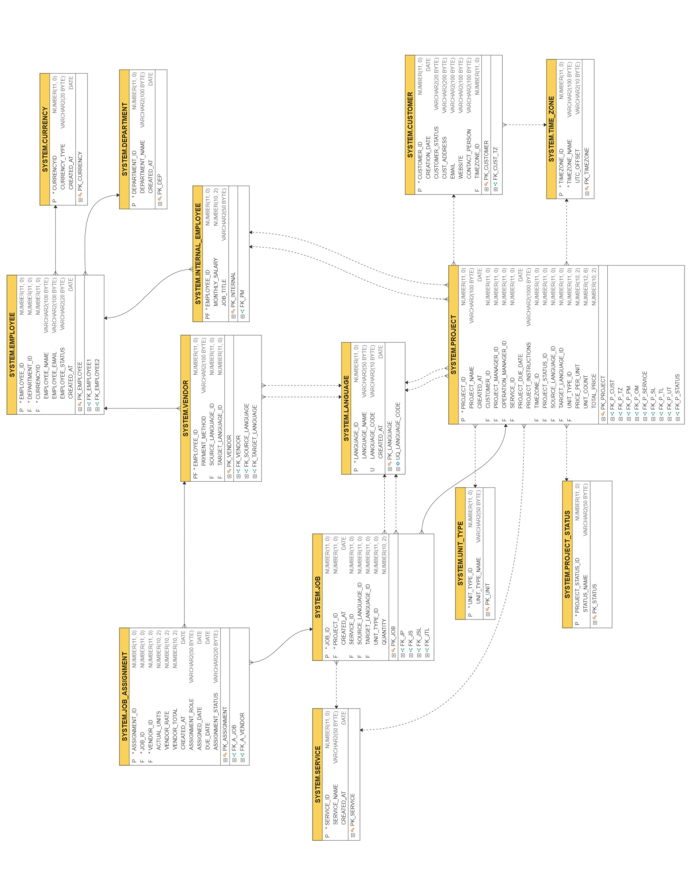

# Localization Management System Database

A relational database system designed for managing localization and translation workflows inside a Localization Service Provider (LSP) environment.

The system centralizes project management, multilingual workflows, vendor assignments, and financial tracking into a structured Oracle SQL database.

---

# Table of Contents

- [Project Overview](#project-overview)
- [Architectural Vision and Scope](#architectural-vision-and-scope)
- [Entity Relationship Diagram](#entity-relationship-diagram)
- [Database Design Approach](#database-design-approach)
- [Technologies Used](#technologies-used)
- [Database Structure](#database-structure)
- [Key Features](#key-features)
- [Financial Logic](#financial-logic)
- [Business Workflow](#business-workflow)
- [Implemented SQL Operations](#implemented-sql-operations)
- [Analytical Queries](#analytical-queries)
- [View Implementation](#view-implementation)
- [Data Integrity](#data-integrity)
- [Future Improvements](#future-improvements)
- [How to Run the Project](#how-to-run-the-project)

---

# Project Overview

Localization projects involve multiple operational layers including:

- Clients
- Project managers
- Vendors / linguists
- Language pairs
- Localization services
- Deadlines
- Financial calculations

This project simulates how a real-world Translation Management System (TMS) operates inside a localization company.

The database supports:

- End-to-end project management
- Vendor assignment workflows
- Multilingual operations
- Revenue and cost tracking
- Operational reporting
- Business analytics

---

# Architectural Vision and Scope

In the competitive Localization Service Provider (LSP) landscape, a Translation Management System (TMS) acts as the operational backbone coordinating multilingual production workflows.

This database architecture transforms scattered localization data — linguist expertise, project requirements, multilingual workflows, deadlines, and financial metrics — into a centralized relational structure.

The system focuses on:

- Data consistency
- Referential integrity
- Workflow traceability
- Financial visibility
- Scalable localization operations

---

# Entity Relationship Diagram

## Database ERD



---

# Database Design Approach

The schema follows normalization principles to reduce redundancy and maintain data integrity.

## Main Design Concepts

### 1. Project → Job Hierarchy

A single localization project may contain multiple jobs.

Example:
- Translation
- Editing
- LQA
- MTPE

This creates a **1:M relationship** between `Project` and `Job`.

---

### 2. Employee Supertype/Subtype Design

The system implements inheritance using:

- `Employee` → supertype
- `Internal_Employee` → subtype
- `Vendor` → subtype

This avoids duplicated employee information while allowing role-specific attributes.

---

### 3. Associative Entity

`Job_Assignment` acts as an associative entity between:

- `Job`
- `Vendor`

This enables:

- Multiple assignments
- Vendor workload tracking
- Cost calculations
- Assignment status management

---

### 4. Virtual Columns

The schema uses generated virtual columns for automatic financial calculations.

Example:

```sql
Total_Price NUMBER(10,2)
GENERATED ALWAYS AS (Price_Per_Unit * Unit_Count) VIRTUAL
```

This guarantees consistent calculations without manual updates.

---

# Technologies Used

- Oracle SQL
- Oracle Database
- Relational Database Modeling
- ERD Design
- SQL Views
- Aggregate Functions
- Constraints & Referential Integrity

---

# Database Structure

## Lookup Tables

| Table | Purpose |
|---|---|
| Language | Stores supported languages |
| Service | Stores localization services |
| Currency | Stores supported currencies |
| Department | Stores departments |
| Unit_Type | Defines pricing units |
| Project_Status | Defines project workflow status |
| Time_Zone | Stores timezone information |

---

## Main Business Tables

| Table | Purpose |
|---|---|
| Employee | Base employee information |
| Internal_Employee | Internal staff |
| Vendor | External linguists/vendors |
| Customer | Client information |
| Project | Main localization projects |
| Job | Project tasks/services |
| Job_Assignment | Vendor assignments |

---

# Key Features

## Project Management

- Create localization projects
- Assign project managers
- Track deadlines and statuses

---

## Vendor Management

- Store vendor language pairs
- Track vendor assignments
- Monitor vendor workload

---

## Financial Tracking

- Revenue calculation
- Vendor cost calculation
- Margin analysis
- Profitability reporting

---

## Workflow Tracking

- Assignment statuses
- Due dates
- Delivery schedules
- Turnaround analysis

---

## Reporting & Analytics

- PM performance reports
- Revenue reports
- Language demand analysis
- Vendor workload analysis

---

# Financial Logic

The system separates:

- Customer revenue
- Vendor operational costs

This enables accurate profitability analysis per project.

---

## Revenue Formula

```sql
Total_Price = Price_Per_Unit * Unit_Count
```

---

## Vendor Cost Formula

```sql
Vendor_Total = Actual_Units * Vendor_Rate
```

---

## Margin Formula

```sql
Margin = Revenue - Cost
```

---

# Business Workflow

## Step 1 — Customer Creates a Request

A customer submits a localization request.

---

## Step 2 — Project Creation

The project manager creates a project including:

- Source language
- Target language
- Service type
- Deadline
- Pricing

---

## Step 3 — Job Breakdown

The project is divided into multiple jobs such as:

- Translation
- Review
- LQA

---

## Step 4 — Vendor Assignment

Vendors are assigned to jobs through `Job_Assignment`.

---

## Step 5 — Financial Tracking

The system automatically calculates:

- Revenue
- Vendor cost
- Margin

---

# Implemented SQL Operations

The project includes:

- DDL (`CREATE TABLE`)
- DML (`INSERT`, `UPDATE`)
- Aggregate Queries
- Analytical Reports
- SQL Views
- Constraints
- Foreign Keys
- Virtual Columns

---

# Analytical Queries

The project includes several business-oriented analytical queries.

---

## 1. Project Dashboard

Provides:

- Revenue
- Cost
- Margin
- PM Name
- Service
- Languages
- Deadline

---

## 2. PM Performance Report

Tracks:

- Number of managed projects
- PM workload

---

## 3. Language Pair Demand Report

Identifies:

- Most requested language pairs

---

## 4. Vendor Workload Report

Shows:

- Vendors currently handling active projects

---

## 5. Customer Revenue Contribution

Measures:

- Revenue generated per customer

---

## 6. Turnaround Time Analysis

Calculates:

- Project turnaround duration
- Assignment duration

---

# View Implementation

## Project Dashboard View

```sql
CREATE OR REPLACE VIEW Project_Dashboard AS
```

The view consolidates operational and financial information into a single reporting layer for easier analysis.

---

# Data Integrity

The system enforces integrity using:

- Primary Keys
- Foreign Keys
- Unique Constraints
- NOT NULL Constraints
- Referential Integrity

Example:

```sql
CONSTRAINT FK_P_Cust
FOREIGN KEY (Customer_ID)
REFERENCES Customer(Customer_ID)
```

---

# Future Improvements

Potential future enhancements include:

- CAT tool integration
- Translation memory tracking
- Invoice generation
- Quality scoring system
- Multi-currency conversion
- Role-based access control
- Workflow automation
- Vendor rating system

---

# How to Run the Project

## Step 1

Open Oracle SQL Developer or any Oracle-compatible SQL environment.

---

## Step 2

Run the SQL script in the following order:

1. DROP statements
2. CREATE TABLE statements
3. INSERT statements
4. Analytical queries and views

---

## Step 3

Execute the reporting queries to analyze the generated data.

---

# Sample Analytical Queries

## Number of Jobs Per Project

```sql
SELECT Project_ID, COUNT(*)
FROM Job
GROUP BY Project_ID;
```

---

## Highest Revenue Projects

```sql
SELECT 
    Project_Name,
    Total_Price AS Revenue
FROM Project
ORDER BY Total_Price DESC;
```

---

## PM Performance Report

```sql
SELECT 
    e.Employee_Name,
    COUNT(p.Project_ID) AS Managed_Projects
FROM Employee e
JOIN Project p
    ON e.Employee_ID = p.Project_Manager_ID
GROUP BY e.Employee_Name
ORDER BY Managed_Projects DESC;
```

---

# Author

Developed as a Database Systems project focused on modeling real-world localization operations using relational database principles and Oracle SQL.
